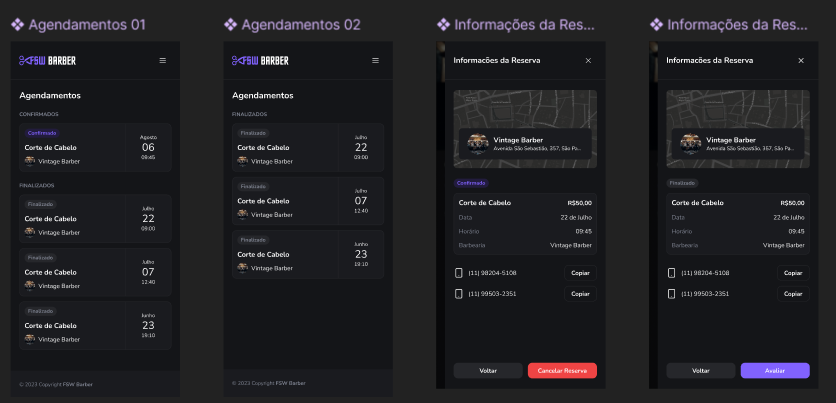
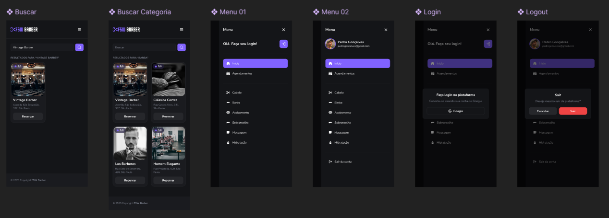

<h4 align="center"> 
	🚧 Projeto Barbearia 🚧
</h4>

<p align="center">
	
    <!---->
</p>

<p align="center">
    <a href="#-sobre-o-projeto">Sobre</a> •
    <a href="#-funcionalidades">Funcionalidades</a> •
    <a href="#-tecnologias">Tecnologias</a> •
    <a href="#-layout">Layout</a> •  
    <a href="#-como-executar-o-projeto">Como executar</a> • 
    <a href="#-autor">Autor</a> • 
    <a href="#user-content--licença">Licença</a>
</p>

## 💻 Sobre o projeto

Projeto desenvolvido durante a **Full Stack Week - Edição 5**, semana de desenvolvimento de software oferecida pelo [Felipe Rocha](https://github.com/felipemotarocha) que acontecerá do dia **05/08 a 12/08**.

---

## ⚙️ Funcionalidades 

- [x] Login com Google
- [x] Agendar Serviços
- [ ] Cancelar Serviços
- [ ] Email de Confirmação

---

## 🛠 Tecnologias

As seguintes ferramentas serão usadas na construção do projeto:

- **Next.js**
- **React.js**
- **PostgreSQL**
- **Tailwind CSS**
- **Prisma**
- **Node.js**
- **ShadCN**
- **TypeScript**
- **JavaScript**

---

## Layout

<div>
  
</div>

<div>
  
</div>

<div>
  
</div>

---

## 🛠 Como executar

**Pré-requisitos:**

Antes de começar, você vai precisar ter instalado em sua máquina as seguintes ferramentas:
[Git](https://git-scm.com), [Node.js e npm (ou yarn)](https://nodejs.org/en/). 
Além disto é bom ter um editor para trabalhar com o código como [VSCode](https://code.visualstudio.com/)

**Clonar o repositório:**

```bash
git clone https://github.com/jeferssoncavalcante/Projeto-Barbearia.git
```

**Instalar Dependências:**

```bash
cd seu-repositorio

npm install
```

**Obs: Configure seu banco de dados e seu arquivo .env para serem executados em conjunto com prisma.**

***Instale e execute o prisma:***

```bash
npm install --save-dev prisma

npx prisma init

npx prisma migrate dev
```

***Execute o Projeto:***

```bash
npm run dev
```

---

## Autor

Projeto oferecido pelo [Felipe Rocha](https://github.com/felipemotarocha), durante a **Full Stack Week - Edição 5**.

---

## Licença

Este projeto está licenciado sob a licença MIT. Veja o arquivo LICENSE para mais detalhes.

---